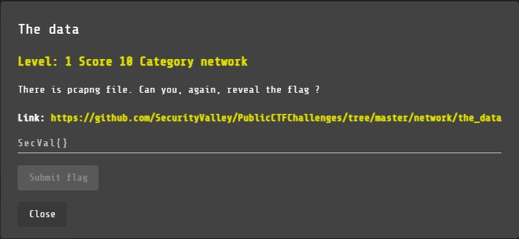
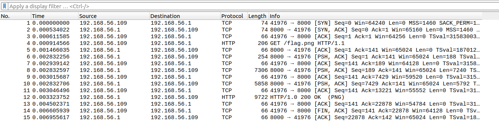
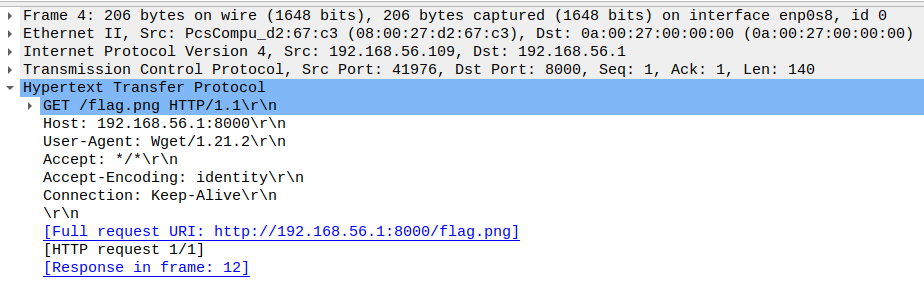
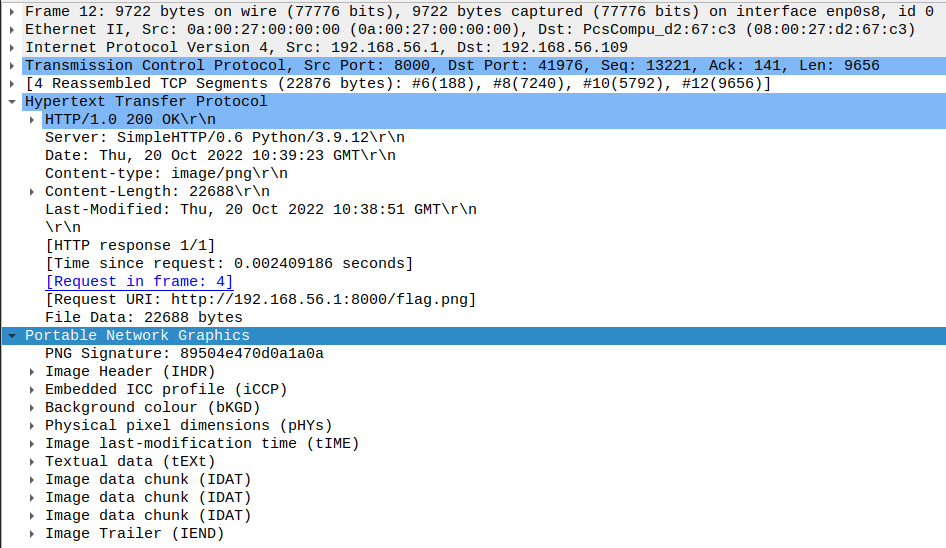

# The Data

NETWORK, 10 points

## Description

## Solution

Nos brindan una captura de tráfico de red:

Al observarla notamos que hay un paquete HTTP que hace un GET a una dirección.

Buscamos la respuesta al GET y notamos que devuelve una imagen PNG:

Descargamos la imagen PNG y vemos que contiene la flag:

Realizamos un script que ejecuta los comandos necesarios para extraer la imagen PNG y tomar de ella la flag. Nos muestra por consola un aproximado de la flag contenida en la imagen:

Reto completado:

