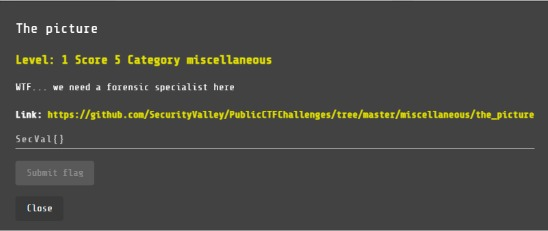

# The Picture

MISC, 5 points

## Description

## Solution

Nos brindan un archivo con una imagen:

Aparentemente la imagen no contiene información relevante, por lo tanto suponemos que contiene un mensaje oculto. Usando el comando zsteg verificamos que hay un mensaje oculto.

Realizamos un script que ejecuta el comando y nos muestra la flag oculta:

Reto completado:

