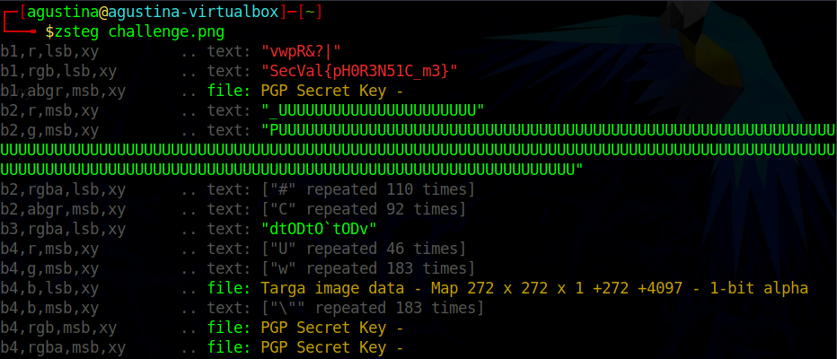

# The Picture

MISC, 5 points

## Description

## Solution

Nos brindan una imagen:

Aparentemente la imagen no contiene información relevante, por lo tanto suponemos que podría contener un mensaje oculto. Usando el comando zsteg verificamos que hay un mensaje oculto.

Realizamos un script que ejecuta el comando y nos muestra la flag oculta:

Reto completado:

Realizamos un script genérico que se puede utilizar con cualquier archivo png y con un diccionario que incluye las partes de la flag conocidas:

