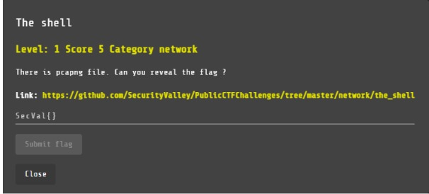
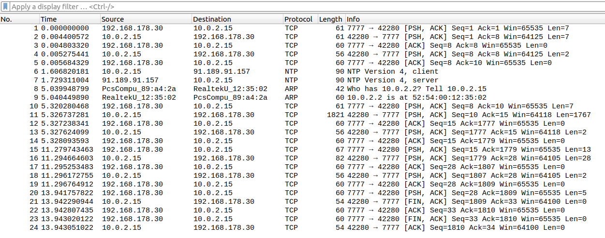
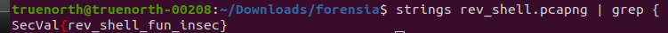
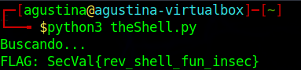
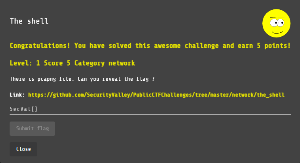

# The Shell

NETWORK, 5 points

## Description

## Solution

Nos brindan un archivo que contiene una captura de tráfico de red:

Al observarla no notamos nada relevante. Por lo tanto ejecutamos el comando strings sobre el archivo, filtrando con grep "{", ya que sabemos que el formato de la flag contiene "{".

Realizamos un script que ejecuta los comandos y nos muestra la flag oculta en los strings del archivo:

Reto completado:

